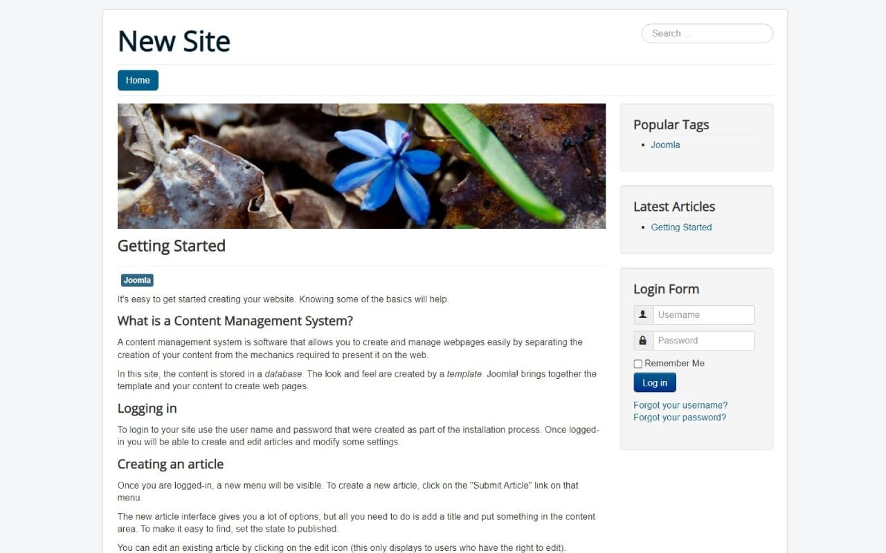

# Joomla CI/CD pipeline

Deploy Joomla server with CI/CD on Elestio

 
 

# Once deployed ...

You can open Joomla UI here:

    URL: https://[CI_CD_DOMAIN]
    login: "[ADMIN_EMAIL]"
    password: "[ADMIN_PASSWORD]"

You can open PHPMyAdmin here:

    URL: https://[CI_CD_DOMAIN]:55579
    login: "root"
    password: [ADMIN_PASSWORD]
